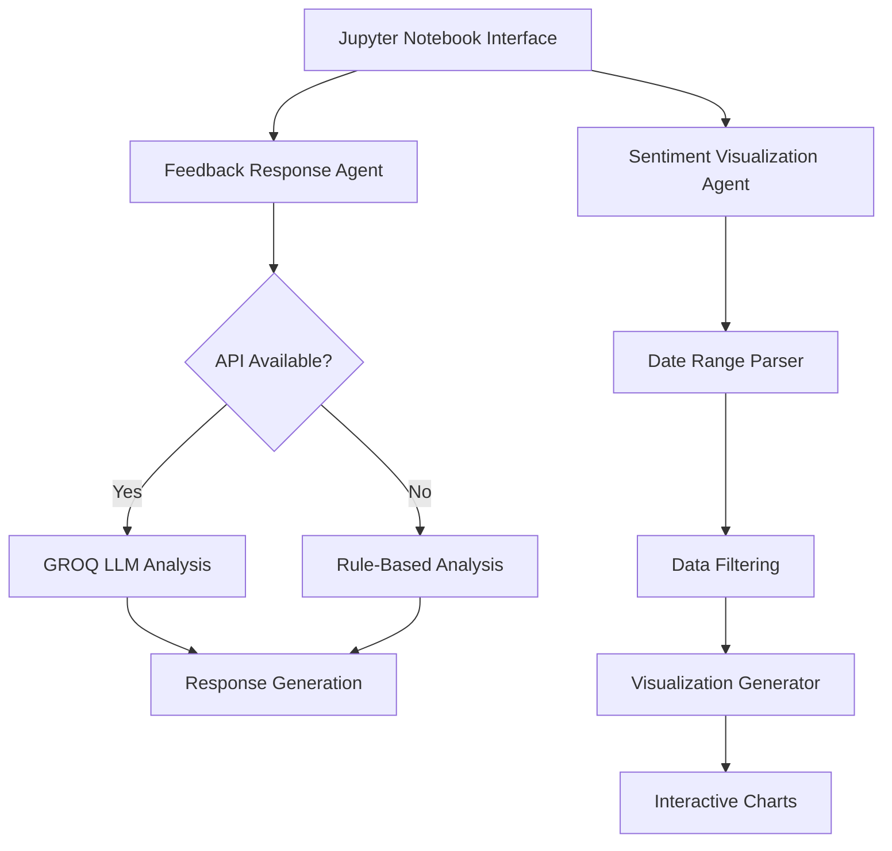

# SteamNoodles Feedback Agent System 🍜

Automated **dual-agent** system for analyzing customer restaurant feedback and visualizing sentiment trends.

## 👤 Author

* **Name:** Thejan Wijesinghe
* **University:** General Sir John Kotelawala Defence University (KDU)
* **Year:** 2nd Year


## 📌 1. Project Overview

**SteamNoodles** processes textual customer reviews (food, service, ambiance, etc.) and enhances basic sentiment reporting using two specialized AI agents:

| Agent                             | Purpose                                                         | Modes                                    |
| --------------------------------- | --------------------------------------------------------------- | ---------------------------------------- |
| **Feedback Response Agent**       | Classify sentiment + generate polite, context-aware replies     | GROQ LLM (online) / Rule-based (offline) |
| **Sentiment Visualization Agent** | Generate daily sentiment counts + trend plots over a date range | Pure Python (deterministic)              |

The system is **Jupyter Notebook–driven** for transparency, experimentation, and reproducibility.


## 🎯 2. Objectives

* Classify sentiment (**positive / negative / neutral**)
* Automatically generate **personalized feedback replies**
* Visualize **daily sentiment counts & trends** with bar/line plots
* Support **natural language date ranges** (e.g., “last 7 days”, “Aug 1 to Aug 15, 2025”)
* Provide **dual-mode fallback** (GROQ API or rule-based)


## 🏗 3. System Architecture




## 🚀 4. Quick Start (Google Colab Recommended)

[](https://colab.research.google.com/github/lenoshz/steamnoodles-feedback-agent-thejan/blob/main/SteamNoodles_Feedback_System.ipynb)

### 4.1 Open the Notebook

* **Option A (recommended):** Click the Colab badge above.
* **Option B:** Manually upload `SteamNoodles_Feedback_System.ipynb` to Colab.

### 4.2 Mount Google Drive (Optional)

```python
from google.colab import drive
drive.mount('/content/drive')
```

### 4.3 Install Dependencies

```python
!pip install -q langchain-groq langchain pandas matplotlib seaborn python-dateutil tqdm python-dotenv ipywidgets
```

### 4.4 Enable Widget Support (Colab)

```python
from google.colab import output
output.enable_custom_widget_manager()
```

### 4.5 Set GROQ API Key (Optional)

```python
import os
os.environ["GROQ_API_KEY"] = "your_key_here"
```

If omitted → system **auto-falls back** to rule-based mode.

### 4.6 Run the Notebook

Execute cells top → bottom. Console output will show:

```
GROQ API is available
# or
GROQ API is not available - will use rule-based approach
```

---

## 💻 5. Local Development Setup

```bash
git clone https://github.com/lenoshz/steamnoodles-feedback-agent-thejan
cd steamnoodles-feedback-agent-thejan

# Create virtual environment
python -m venv .venv
# Activate: Win -> .venv\Scripts\activate | Mac/Linux -> source .venv/bin/activate

# Install dependencies
pip install -r requirements.txt
# OR install manually:
pip install langchain-groq langchain pandas matplotlib seaborn python-dateutil tqdm python-dotenv ipywidgets
```

Run notebook:

```bash
jupyter notebook SteamNoodles_Feedback_System.ipynb
```

Optional `.env` file:

```
GROQ_API_KEY=your_key_here
```

Enable widgets in classic Jupyter:

```bash
jupyter nbextension enable --py widgetsnbextension
```

---

## 📊 6. Dataset

* If `restaurant_reviews.csv` exists → system loads it (`date, text, sentiment`).
* Otherwise → synthetic dataset (30 days, probabilistic sentiment distribution) is auto-generated.
* You can replace it with a **Kaggle dataset** (ensure columns & timestamps are compatible).

---

## 🤖 7. Agent Details

### 7.1 Feedback Response Agent

**Rule-based mode:**

* Sentiment via keyword hit counts.
* Topic detection: food, service, cleanliness, ambiance, price.
* Generates **templated polite replies**.

**LLM mode (GROQ):**

* Structured prompt → JSON output: `{sentiment, topics, response}`
* Auto fallback to rule-based if JSON parse/API fails.

Example:
Input:

```
"The noodles were amazing and the service was exceptional!"
```

Output:

```json
{
  "sentiment": "positive",
  "topics": ["food", "service"],
  "response": "Thank you for your wonderful feedback! We’re delighted you enjoyed both our noodles and service."
}
```

---

### 7.2 Sentiment Visualization Agent

* `parse_date_range(text)` supports:

  * `last X days`
  * `this week`
  * `this month`
  * Explicit ranges: `"Aug 1 to Aug 15, 2025"`

* Core functions:

  * `generate_daily_sentiment_chart(range_text)`
  * `generate_sentiment_trend_chart(range_text)`

* Interactive widgets allow **date range & chart type selection** (bar/line).

---

## 📝 8. Usage Walkthrough

1. **Startup check:**

   ```
   GROQ API is available
   # or
   GROQ API is not available - will use rule-based approach
   ```

2. **Feedback Analyzer:**

   * Input: `"We waited 40 minutes and the noodles were cold, but staff tried to help."`
   * Output:

     * Sentiment: **negative**
     * Topics: **food, service**
     * Polite reply generated automatically.
    


3. **Visualization:**

   * Input: `last 7 days` or `August 1 to August 16, 2025`
   * Choose: **bar chart** or **line chart**

<p align="center">
  
</p>

<p align="center">
    
</p>

---

## 🛠 9. Troubleshooting

| Issue                  | Fix                                         |
| ---------------------- | ------------------------------------------- |
| Widgets not rendering  | Run `output.enable_custom_widget_manager()` |
| API key not detected   | Set via `os.environ[...]` or `.env`         |
| API errors             | System auto-falls back to rule-based        |
| Matplotlib not showing | Add `plt.show()`                            |
| Timezone mismatch      | Adjust synthetic generator end date         |

---

## 📜 10. License

This project is licensed under the **MIT License** – see the [LICENSE](LICENSE) file for details.
